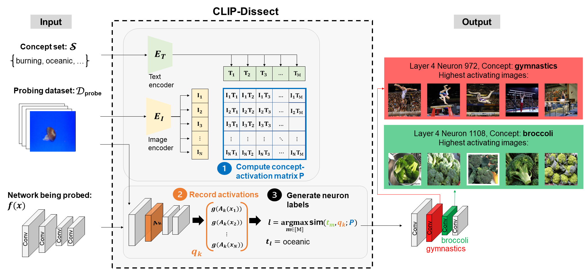

## CLIP-Dissect

An automatic and efficient tool to describe functionalities of individual neurons in DNNs.

This is the official repository for our paper: [CLIP-Dissect: Automatic Description of Neuron Representations in Deep Vision Networks](https://arxiv.org/abs/2204.10965) published at ICLR 2023. 

**Update 6/5/23**: We have conducted a crowdsourced evaluation of our description quality, results are available on [arxiv](https://arxiv.org/abs/2204.10965) (Appendix B).



## Installation

1. Install Python (3.10)
1. Install Pytorch (tested with 1.12.0, also works with 2.0) and Torchvision >= 0.13 following instructions from https://pytorch.org/get-started/previous-versions/
3. Install remaining requirements using `pip install -r requirements.txt`
4. Download the Broden dataset (images only) using `bash dlbroden.sh`
5. (Optional) Download ResNet-18 pretrained on Places-365: `bash dlzoo_example.sh`

We do not provide download instructions for ImageNet data, to evaluate using your own copy of ImageNet validation set you must set 
the correct path in `DATASET_ROOTS["imagenet_val"]` variable in `data_utils.py`.

## Quickstart:

This will dissect 5 layers of ResNet-50(ImageNet) using Broden as the probing dataset. Results will be saved in `results/resnet50_{datetime}/descriptions.csv`.

```
python describe_neurons.py
```

## Recreating experiments

The results used for figures and tables of our paper can be recreated by running the corresponding notebook in the `experiments` folder, for example to reproduce Table 1 run `experiments/table1.ipynb`.

## How to modify:

### Dissecting your own model

1. Implement the code to load your model(in eval mode) and a preprocess function to correctly load images for your model in `get_target_model` function of `data_utils.py` under an if statement for target_name of you choice. 
2. Dissect the model by running `python describe_neurons.py --target_model {model_name}`

### Using your own probing dataset

1. Implement code to load your dataset as a torchvision DataSet uin the `get_data` function of `dataset_utils.py`
2. Add your dataset name into the choices of `--d_probe` argument in `describe_neurons.py`
3. Dissect the model by running `python describe_neurons.py --d_probe {dataset_name}`

### Using your own concept set

1. Create/download a .txt file containing your concept set, which each concept on a separate line
2. Dissect the model by running `python describe_neurons.py --concept_set {path_to_conceptset}`

### Specifying device

You can specify which device is used with the `--device` argument, which defaults to `cuda`, i.e. `python describe_neurons.py --device cpu`

## Sources:

- CLIP: https://github.com/openai/CLIP
- Text datasets(10k and 20k): https://github.com/first20hours/google-10000-english
- Text dataset(3k): https://www.ef.edu/english-resources/english-vocabulary/top-3000-words/
- Broden download script based on: https://github.com/CSAILVision/NetDissect-Lite

## Common errors

**Incorrect activations cached:**

The code automatically caches the saved activations of target model and CLIP in `saved_activations`, and if a file already exists with the same save name the code will load these activations instead of recalculating. However sometimes you may wish to modify the pipeline in a way that doesn't change the name of the saved activations and want to recalculate the activations. In this case you need to manually delete the relevant files from saved_activations before rerunning CLIP-Dissect, as using incorrect activations will give incorrect results.

## Cite this work

T. Oikarinen and T.-W. Weng, CLIP-Dissect: Automatic Description of Neuron Representations in Deep Vision Networks, ICLR 2023.

```
@article{oikarinen2023clip,
  title={CLIP-Dissect: Automatic Description of Neuron Representations in Deep Vision Networks},
  author={Oikarinen, Tuomas and Weng, Tsui-Wei},
  journal={International Conference on Learning Representations},
  year={2023}
}
```
